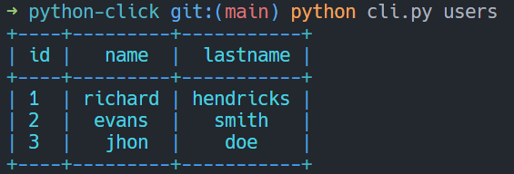
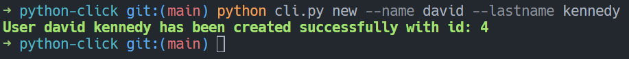
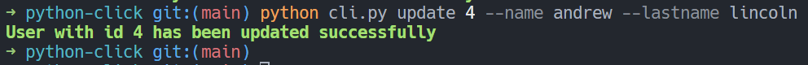
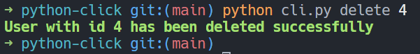

# Python Click

This application use the [Python Click Library](https://pypi.org/project/click/) to create a Command Line Interface (CLI) to perform user CRUD operations on a Json file.

Use of [Pretty Table Library](https://pypi.org/project/prettytable/) and [Colorama Library](https://pypi.org/project/colorama/) to to display data in tables in an attractive ASCII format and set color to the different results.

Example of list of users:

Example of added user:

Example of updated user:

Example of deleted user:

